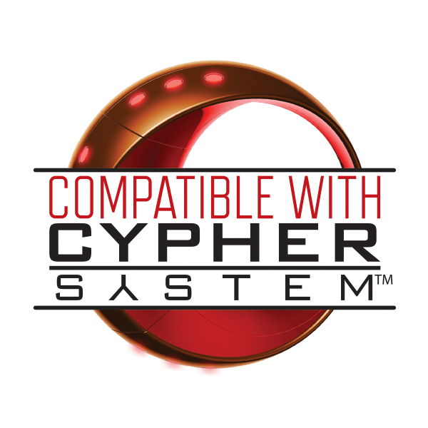

Cypher System Reference is compatible with the Cypher System in accordance with the [Cypher System Open Licence ](https://csol.montecookgames.com) (CSOL). All works using CSRP should conform to this licence. We do not add any more requirements, our work is for the community at large to use, commercialy or otherwise, according to Monte Cook Games licencing.

# Welcome !

There are two parts to this project
- Here on github, we make a cleaned up version of the Cypher System Reference Document in markdown. It is ready for a website, and ready for Obsidian.
- Then there's the weblate project. Weblate is a collaborative translation tool. We use it to translate our version of the CSRD into different languages. This is fed back into GitHub

# Contributing to the weblate project

You can sign up to be a translator by following this link : https://hosted.weblate.org/engage/cypher-system-reference/

Translating in weblate is easy : The project is divided into components (the different markedown files), and each component is divided into strings (paragraphs, sentences). Use weblate to translate strings one at a time. A glossary of common game terms shows on the side while you translate to keep those consistent across a language. Sugestions from google translate comming soon.

YOU CANNOT USE PUBLISHED TRANSLATIONS FOR THIS. ALL TRANSLATIONS MUST BE YOUR OWN

Only french is being worked on for now. Contact me for more languages (it's possible but may cost me money)

# Contributing to the github project

You can help in organising, cleaning and formating the original CSRD here on github. Work of the branch named after the version of the CSRD you're using and make a pull request. No direct submission into main.

Only the latest version of the CSRD will end up in main and get translated. Older versions 

Translations should not be pushed into github, they come from weblate. Only /en and /CSRD should be worked on.

The contents should be only the CSRD, and all the CSRD. No content that is not in the CSRD, no original content. Some information, like tags, can be infered from the CSRD only, those are fine.

# Progress

Work on CSRD 2025-08-22
Core is pretty much done, could use some more linking

# Formatting reference

This document uses markdown best practices
https://www.markdownguide.org/basic-syntax/
- Use two trailing whitespaces to indicate a line break inside a paragraph
- Use a blank line to indicate paragraphs
- Use a blank line before and after headings
- Never use more 5 level of headings (5x# max)
- Never use in a header a character that would not be a filename.
	 - https://stackoverflow.com/questions/1976007/what-characters-are-forbidden-in-windows-and-linux-directory-names

## Cards

Cards are categories of brief descriptions that follow, or could follow, the same formatting, are present in great numbers, and could take advantage of automatic processing.

Card types are defined below, and the most precise and consistent formatting should be applied for this content.

All Cards follow the following principles :  
- Cards are contained in their own headings
	- They start with a heading, whose name is the name of the object described in the card.
	- They end just before the next heading or end of file
	- The goal is that the text can be cut along heading line, including starting heading and ignoring next heading, and provide consistent cards.
	- The name of the card is the name of what is described in the card. 
		- If multiple names are possible, then the most common name is used, and the other names should be included where the name is on the card. 
- Cards start with a tagline
	- The first paragraph of the card, should be in one line the name, then tags.
	- Tags are composed of the character # and a single token, without spaces
	- Tags should never be guessed or imported from outside the document. It should be explicit somewhere in the document that this tag applies. 
	- Tags however can be infered from the document. If a type is explicitly endorsed by a genre, all abilities of that types should be implicitly endorsed for the genre
	- The first tag should be the card type tag. Each type below defines its tag
	- #Obsolete can be used after type tag to mark the card as removed from newer versions of the game.
	- Following tags should include categories of the type of cards.
	- Then Tags should include Genre tags.
		- If the card is defined in the core rules (as opposed to a module or genre), the #Core tag should be on the tag line. 
		- If any genre explicitly endorses or defines that card, a tag with the name of the genre should be applied. A genre endorsement could be implicit, as in an ability in a type or focus that is recommanded should be tagged for that genre.
			- #Fantasy
			- #Modern
			- #ScienceFiction
			- #Horror 
			- #Romance 
			- #SuperHeroes 
			- #PostApo
			- #FairyTale
			- #Historical
			- #Cyberpunk
			- #WeirdWest
			- #ModernFantasy
	- Cards have blocks that are defined for each type. 
		- A block ends with a free line. 
		- Blocks cannot contain free lines. 
		- A freeform block can take any form, as long as it ends a freeline after and none inside.
	- A bullet point list is a series of consecutive lines that start with dash space "- "
	- A numbered list is a series of consecutive lines that start with number dot space "1. ", with number increasing each line.
	- The card ends with one free line, the one closing the last block

### Abilities

- Tagline should be
	- Ability Name(s)
	- Ability Cost
	- #Ability
	- Tag for ability tier ( #Low #Mid or #High) as defined in core ability list
	- #Unused if the ability is not referenced by anything else in the document (type, focus...)
	- Category Tag(s)
		- #AttackAbility 
		- #CompanionAbility 
		- #ControlAbility 
		- #CraftAbility 
		- #CureAbility 
		- #EnvironmentAbility 
		- #InformationAbility 
		- #MetaAbility 
		- #MovementAbility 
		- #ProtectionAbility 
		- #SensesAbility 
		- #SocialAbility 
		- #SpecialAttackAbility 
		- #SupportAbility 
		- #TaskAbility 
		- #TransformAbility 
		- Any ability category defined in the main abilities list or elsewhere in the document
		- If no category is explicitly specified somewhere in CSRD, no category tag should be set
	- Genre Tags
- Aptitude freeform
- If abilities are defined in abilities, either make the 
- Last paragraph should only contain usage : "Enabler" or "Action" sentence.

### Type

- Tagline should be :
	- Type name(s)
	- #Type
	- Genre Tags
- Description as a freeform block
- Background connection as a freeform block
	- First line is "TYPE Background Connection" in bold
- Player intrusions as a freeform block
	- First line is "TYPE Player Intrusions" in bold
- Stat pools as a freeform block (that probably include a table)
	- First line is "TYPE Stat Pools" in bold
- A Tier 1 block
	- First line is "First Tier TYPE Abilities" TYPE being the name of the type.
	- Second line is "First-tier TYPE have the following abilities :"
	- Then a bullet point list of fixed abilities
	- An abilities select phrase explaining ability choices
	- An indented abilites bullet list to choose from
- 5 other tier blocks
	- First line is "X Tier TYPE Abilities" in bold, with X being second for second tier, etc.., TYPE being the name of the type.
	- If there are fixed abilities : 
		- Second line is "X-tier Type have the following abilities :"
		- Then a bullet point list of fixed abilities
	- An abilties select phrase explaining ability choices
	- Then an indented abilites list to choose from
- An optional "TYPE Example" freeform block

### Flavor

- Tagline should be :
	- Flavor name(s)
	- #Flavor
	- Genre Tags
- Description as a freeform text
- 6 Tier blocks
	- First line is "X TIER FLAVOR ABILITIES", with X being first for first tier, etc.. ; FLAVOR being the name of the flavor.
	- Following lines are a bullet point list containing only abilities available for tier

### Descriptor

- Tagline should be :
	- Descriptor name(s) 
	- #Descriptor 
	- Genre tags
- Description as a freeform block
- A gains Block
	- Starts with The text "You gain the following characteristics:"
	- a bullet point list of character changes from the descriptor. Each one is a new line and starts with dash and space "- ". Each ability is freeform and can take multiple lines
- An Initial link block
	- Starts with the text "Initial Link to the Starting Adventure: From the following list of options, choose how you became involved in the first adventure."
	- Followed by with a numbered list of options (usually 4). 

### Focus

- The name of a focus should not include the "who"
- Tagline should be :
	- Focus name(s)
	- #Focus
	- Focus Category if specified somewhere in CSRD
		- #AllyFocus 
		- #BasicFocus
		- #EnergyFocus
		- #EnvironmentFocus
		- #ExplorationFocus
		- #InfluenceFocus
		- #IrregularFocus
		- #MovementFocus
		- #StrikerFocus 
		- #SupportFocus
		- #TankFocus
- Focus description as a freeform block
- Abilities block
	- One line per ability gained, starting with "Tier X: " then the name of an ability gained at that tier
	- Ability choices get one line : list all abilities you can choose from, each separated with the word "or"
	- Abilities can be inlined if no card is available
	- All referenced abilities should have a card, but at least the ones that are used for multiple focuses, types, and/or other places
- GM intrusion freeform block

### Skill

- Tagline should be
	- Skill Name(s)
	- #Skill
- Description as a freeform block
- Rules block that references relevant rules for that skill (Climbing skill, climbing rules)

### Item

- Tagline should be :
	- Item Name(s)
	- #Item
	- Item Type if applicable
		- #WeaponLight 
		- #WeaponMedium 
		- #WeaponHeavy 
		- #ArmorLight 
		- #ArmorMedium 
		- #ArmorHeavy 
		- #Shield 
		- #Ammo
	- Price tag : 
		- #Inexpensive 
		- #Moderate 
		- #Expensive 
		- #VeryExpensive 
		- #Exorbitant 
	- Genre tags
- Description of the item as a freeform

### Cypher

- Tagline should be :
	- Cypher Name(s)
	- #Cypher
	- Cypher type if applicable : 
		- #Subtle 
		- #Manifest 
		- #Fantastic 
	- Genre tags
- Level block : "Level : " then the level or level roll
- Optional Form block : "Form : " Then a description of the forms it can take
- Effect block : "Effect : " Then a freeform description of the effect when activated

### Artefact

- Tagline should be :
	- Artifact name(s)
	- #Artifact
	- Genre Tags
- Level block : "Level :" Then the level or level roll of the artifact
- Form block : "Form :" Then a description of the forms the artifact can take
- Effect block : "Effect : " Then a freeform description of the effect when activated
- Depletion block : "Depletion :" Then the depletion roll, or "--" for none

### NPC or Creature

- Tagline should be :
	- Creature name(s)
	- Creature level as a tag, then a space, then target number in parenthesis : #lvl1 (3) #lvl2 (6)...
	- #Creature 
	- Genre Tags
- Optional Description paragraph(s) freeform text
- Optional "Motive: " then freeform text
- Optional "Environment: " then freeform text
- Optional "Health: " then freeform text (often just number)
- Optional "Damage Inflicted: " then freeform text
- Optional "Armor: " then freeform text (often just number)
- Optional "Movement: " then freeform text
- Optional "Modifications: " then freeform text
- Optional "Combat: " then freeform text
- Optional "Interaction: " then freeform text
- Optional "Use : " then freeform text
- Optional "GM intrusion: " then freeform text

## Other (freeform)

- Rules
- Explainations
- Context
- Flavor text
- ...

Should be in headings separate from the cards. The rationale is to be able to automatically cut along headings and get consistent files.

## Genre modules

Should follow the following template :
> # Genre
> ## Setting
> ## Rules
> ## Type
> ## Flavor
> ## Descriptor
> ## Focus
> ## Equipment
> ## Cyphers
> ## Artifacts
> ## Creatures

## Linking conventions

- Use markdown standard links 
	- [https://blog.markdowntools.com/posts/how-to-link-to-a-header-in-markdown](https://blog.markdowntools.com/posts/markdown-internal-links)
 
